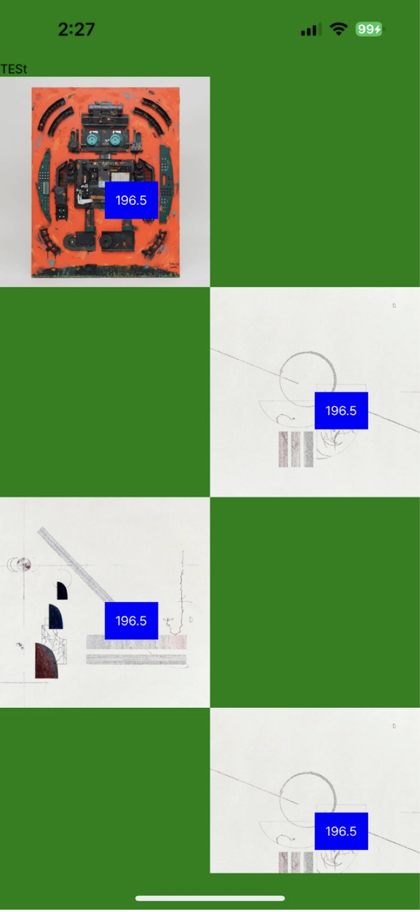
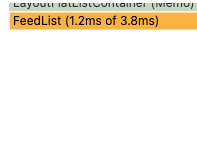

안녕하세요.

ReactNative에서 Masonry 레이아웃 페이지의 성능을 개선했던 경험을 공유드리려고 합니다.
어떤 점들을 개선하였고, 개선하기 위해 시도했던 방법들, 그리고 느낀 점들에 대해 말씀드리겠습니다.

## 들어가기 전에

당시 요구사항은 다음과 같았습니다.

```txt

1. Pinterest와 같은 석조 레이아웃 (Masonry layout)

2. instagram, KREAM(style)과 같은 피드 목록 페이지 (infinite scroll)

```

Masonry 레이아웃이란 많이 알려진 Pinterest 페이지와 같은 석조 레이아웃을 의미합니다.

[CATE](https://apps.apple.com/kr/app/cate-%EC%BC%80%EC%9D%B4%ED%8A%B8/id6444556711) 앱은 아트 플랫폼으로써 피드(feed)라는 소통 공간이 필요하였습니다.
아직 앱이 준비되기 이전이었기 때문에 새롭게 만들어야 했습니다.

저는 최종적으로 위의 요구사항을 지키면서 피드 성능 개선을 위해 **총 6번의 전환 과정**을 시도하였는데요.
제가 시도했던 방법들을 간략하게 말씀드리도록 하겠습니다.

모든 과정이 한 번에 이루어진 것은 아니며, 계속 디벨롭해 나가며 진행되었다는 점을 미리 말씀드릴게요!

## 첫 번째 시도

첫 번째 요구사항에 맞추어 #ReactNative 에서 활용할 수 있는 모든 라이브러리를 찾아보기 시작했습니다.

가장 요구사항에 적합한 라이브러리 [react-native-masonry-list](https://github.com/hyochan/react-native-masonry-list) 를 활용하고자 하였습니다.
검토 당시 아쉽게도 사용 당시 몇 가지 문제점이 있었는데요.

목록이 쌓일수록 높이 값을 계산하지 못해 우측에만 쌓이는 현상이 존재하였습니다. [issue](https://github.com/hyochan/react-native-masonry-list/issues/16)

실무에 적용하기에는 어렵다고 생각되었고 다른 방법을 모색하게 됩니다.

## 두 번째 시도

기존에 시도하였던 react-native-masonry-list 구현 방식을 참고하여 ScrollView 를 이용한 석조형 레이아웃을 **직접 구현**하기로 합니다.

react-native-masonry-list 또한 [ScrollView로 구현](https://github.com/hyochan/react-native-masonry-list/blob/main/index.tsx)되어있어 적합한 방법이라고 생각하였습니다.
우측에 쌓이는 현상만 해결하면 사용 가능해 보였기 때문입니다.

구현 방식은 colum 수에 따라 데이터를 나누어서 레이아웃을 나누어 화면에 그려주었습니다.

최종적으로 우측에 쌓이는 현상을 해결하였지만, 한 가지 큰 문제점이 존재하였는데요.

ScrollView는 모든 요소를 한 번에 #렌더링 하기 때문에 대용량의 데이터를 처리하기에는 옳지 않은 방법이었습니다.

테스트 단계에서는 적은 양의 데이터를 처리했기 때문에 큰 이슈가 발생하지 않는 것처럼 보였는데요.
iOS 환경에서의 퍼포먼스는 준수 한 편이었지만, Android 환경에서 점차 문제가 생기기 시작했습니다.

이 또한 실무에 적용하기에 어렵다고 생각되었고 다른 방법을 모색하게 되었습니다.

## 세 번째 시도

기존에 작업되어 있던 **ScrollView를 FlatList로 전환**을 시도하였습니다.

FlatList는 많은 양의 데이터를 처리하기에 적합하기에 꼭 필요한 과정이었습니다.

그렇다면 FlatList를 이용하여 어떻게 Masonry 레이아웃을 구현할 수 있을까요?

우선 column을 나누어 렌더링 하려면 `numColumns` 을 이용하면 됩니다.

이후 저는 `postion:'absolute'` 를 활용하여 Pinterest 와 같은 레이아웃을 그려주는 방법으로 시도하였는데요.

이 또한 다른 문제점을 맞닥뜨리게 됩니다. `onEndReached` 를 통해 다음 데이터를 불러오게 되면서 레이아웃이 무너지는 현상이 발생하였고 사용하기에는 불가능하다고 판단되었습니다.

## 네 번째 시도

`numColumns` 와 `postion:'absolute'` 를 활용한 방법을 버리고 `CellRendererComponent` 활용한 석조 레이아웃을 구현하기로 합니다.



column 수에 맞추어 영역을 구분해 주게 되면 위와 같은 모습을 띄우게 됩니다.

이후 CellRendererComponent를 활용한 위치 계산식을 추가하여 영역을 재설정 해주었는데요.

아쉽게도 또 다시 문제점들이 발생되었습니다.


목록이 쌓일 수록 스크롤이 떨리는 현상이 발생하고 스크롤 위치가 변경되는 이슈였습니다.

(영상 마지막 부분을 보면 떨림 현상이 존재한다. 😭)

## 다섯 번째 시도

`CellRendererComponent` 를 제거하고 위치 계산식을 개선하였습니다.

이후 Scroll 위치가 변동되는 이슈는 사라지게 되었습니다.

당시 테스트 기기 중 하나인 Android S9 에서 많은 양의 데이터를 처리할 때 스크롤을 내릴 수 조차 없었으나, 로딩이 있긴 하나 페이지를 내릴 수 있는 정도가 까지 개선되었는데요.

어느 정도 사용 할 정도가 되었으니 모든 최적화 방법을 검토하고 적용해 보자 생각하였습니다.

이후 FlatList 내 최적화 옵션들을 적용하였습니다.

- keyExtractor

- getItemLayout

- windowSize

- MaxtoRenderPerBatch

- initialNumToRender

- removeClippedSubviews

또한 이미지 위주로 화면을 그려주기 때문에 [raect-native-fast-image](https://github.com/DylanVann/react-native-fast-image)를 적극적으로 활용하였습니다.
적용 후 눈에 띄게 개선되었지만 초기 렌더링 속도가 아직 10s 이상 지연되었습니다.

심적으로 많은 좌절감을 가지기도 하였으나, 처음으로 다시 돌아가 다른 방법들을 모색하기로 하였습니다.

이후 찾게 된 신생 라이브러리 [FlashList](https://www.npmjs.com/package/@shopify/flash-list) 를 찾게 됩니다.

## 여섯 번째 시도

FlatList 에서 FlashList 로 전환 작업을 진행하였습니다.

FlatList 성능의 UI thread **5배** JS thread **10배**의 퍼포먼스를 지닌 라이브러리 였습니다.

석조 레이아웃 ( 두줄보기 )

- FlatList 에서 좌/우 높이 계산식을 통한 UI 배치 방법에서 FlashList 에서 제공하는 MasonryFlashList 로 전환
- 높이 계산식 제거함으로써 계산 과정이 생략되었습니다.

기본 레이아웃 ( 한줄보기 )
- FlatList -> FlashList 로 전환


전환 작업 이후 약 10s 정도의 렌더링 속도에서 1~2s 로 대폭 감소되었습니다. 눈에 띄는 변화였는데요.

FlashList 의 성능을 최대로 활용하기 위해서는 컴포넌트 내부의 useState 의 사용을 지양 했어야 했습니다. [FlashList Recycling](https://shopify.github.io/flash-list/docs/recycling)

최종적으로 이를 위한 리팩터링을 진행하였습니다.

리팩터링 기간 동안 백엔드 팀에서는 Image resize 작업을 같이 진행해 주셨습니다.(감사합니다 🙇🏻)

기존의 렌더링 할 Item 내에 state 가 존재하였고, 하나의 컴포넌트에 모든 처리 과정이 담겨있었습니다.

1. FlashList 내에서 state 를 제어하기 위한 불필요한 코드들

2. UI / UX 로직

3. 비즈니스 로직

이를 위해 리 팩터링 목표를 크게 다음과 같이 선정하였습니다.

1. 컴포넌트 세분화

2. 컴포넌트 내 State 제거

작업에 앞서 각각 역할에 대해 다시 한번 검토를 진행하였습니다.

최종적으로 기존의 집중되어 있던 하나의 컴포넌트에서 총 20개의 컴포넌트로 분리되었습니다.

- Atomic Design Pattern 을 적용하여 총 20개의 Atom 컴포넌트로 리 팩터링 하여 컴포넌트 간 의존 관계를 제거하였습니다.

- 분리한 컴포넌트의 추상화 수준을 변경하여 선언적 프로그래밍이 가능하도록 변경되었습니다.

- 피드와 연관된 컴포넌트를 Compound Component 로 구성하여 응집도가 높은 컴포넌트로 설계 하였습니다.

- 비즈니스 로직의 경우 부모 페이지에서 역할을 수행할 수 있도록 변경하여 모든 의사결정을 컴포넌트를 할당한 위치에서 제어할 수 있게 되었습니다.

- 메모리 절약

- 컴포넌트 내 모든 addEventlistener 를 제거하고 최상위 요소에 이벤트를 위임하였습니다.

      ( n 개의 피드 수에 따라 n 개의 Event 가 할당되고 있었다. )

    - Redux 에서 유저정보를 조회해서 피드 작성 유저와 비교하는 로직

모든 리팩터링을 진행한 후에 [Flipper](https://fbflipper.com/) Profiler 로 측정한 결과



최종적으로 10s 정도의 렌더링이 3.8ms 로 개선되었고 안드로이드 환경에서도 문제없이 작동하였습니다.

## 마치며

적어놓고 보니 긴 삽질 과정 늘어놓은 것 같네요. 하지만 과정 속에 계속해서 여러 이슈들과 부딪히면서 ReactNative에 대해 더 알게 되고 성장할 수 있었던 시간이었습니다. 그리고 한 가지 생각에 갇혀있기보다는 처음으로 다시 돌아가서 생각해 보는 것도 문제를 해결하는 하나의 방법인 것 같습니다.

추가로 팀원들과 이슈를 공유하면서 FE/BE 모두 더 나은 서비스로 발전시킬 수 있었던 소중한 경험이었습니다.

FlashList 적용을 고려하시는 분들께 약간의 도움이 되었길 바라면서 마치도록 하겠습니다.

감사합니다.
