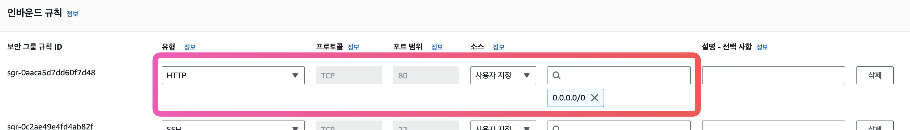
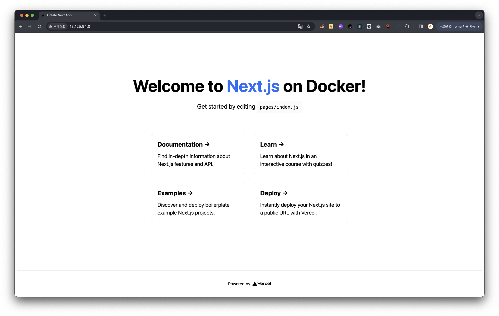

## EC2 인스턴스 생성

인스턴스를 생성하고 docker를 설치한다.

```bash
yum install docker
service docker start
```

다음으로 #Nginx 이미지를 내려받는다.

```bash
docker search nginx
docker pull nginx
docker images
```

## 도커 컴포즈 설치

docker-compose latest 버전 설치

```bash
sudo curl -L https://github.com/docker/compose/releases/latest/download/docker-compose-$(uname -s)-$(uname -m) -o /usr/local/bin/docker-compose
```

권한 변경

```bash
sudo chmod +x /usr/local/bin/docker-compose
```

버전 확인

```bash
docker-compose version
```

[참고자료](https://gist.github.com/npearce/6f3c7826c7499587f00957fee62f8ee9)

이후 사용할 EC2 인스턴스의 보안그룹을 수정해야한다. 여기서 인바운드 규칙을 설정한다.
80포트를 열어주었다.



## Nextjs 프로젝트 추가하기

프로젝트는 #NextJS 에서 제공하는 [예제](https://github.com/vercel/next.js/tree/canary/examples/with-docker)로 대체한다.

```bash
npx create-next-app --example with-docker nextjs-docker
```

위 명령어로 쉽게 프로젝트를 생성할 수 있다.

```txt
## Using Docker

1. [Install Docker](https://docs.docker.com/get-docker/) on your machine.
2. Build your container: `docker build -t nextjs-docker .`.
3. Run your container: `docker run -p 3000:3000 nextjs-docker`.

You can view your images created with `docker images`.
```

이미지를 생성하는 방법은 예제 링크에 위와같이 README에 잘 소개가 되어있다.

## YAML 파일 추가

```yml
version: '3.0'
services:
  nginx:
    image: nginx:latest
    ports:
      - "80:80"
    volumes:
      - ./nginx.conf:/etc/nginx/nginx.conf
    container_name: nginx-web
    depends_on:
      - web
  web:
    image: nextjs-docker
    ports:
      - "3000:3000"
    container_name: nextjs-web
```

nginx.conf를 추가한다.
경로가 다르다면 docker-compose.yml의 volumes 경로를 수정해줄 필요가 있다.

```txt
user  nginx;
worker_processes  auto;

error_log  /var/log/nginx/error.log notice;
pid        /var/run/nginx.pid;


events {
    worker_connections  1024;
}


http {
    ...
	
	upstream next-web {
		server nextjs-web:3000;
	}
	
	server {
		listen 80;
		
		location / {
			proxy_http_version 1.1;
			proxy_set_header Upgrade $http_upgrade;
			proxy_set_header Connection 'upgrade';
			proxy_set_header Host $host;
			proxy_set_header X-Real-IP $remote_addr;
			proxy_set_header X-Forwarded-For $proxy_add_x_forwarded_for;
			proxy_set_header X-Forwarded-Proto $scheme;
			proxy_cache_bypass $http_upgrade;
			proxy_pass http://next-web;
		}
	}
}
```


이후 `docker-compose up -d` 명령을 실행하고 확인해보면 정상적으로 동작하는 것을 볼 수 있다.


